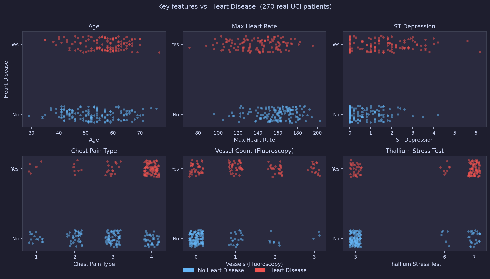

# Squeezing the Last Drops

### Predicting Heart Disease on Kaggle

One challenge · 3,882 teams · and the brutal law of **diminishing returns**

<div class="pt-12 text-gray-400">
  Kaggle Playground Series — Season 6, Episode 2
</div>

---

## A note on AI-assisted development

Most of the code and brainstorming in this project was written with **Claude Code**.

<v-clicks>

- **Generally impressive** — feature engineering ideas, ensemble analysis, cluster setup scripts, experiment design
- **Infrastructure lifesaver** — setting up Ray across two machines, MLflow tracking, Makefile automation: things I would have spent days on took hours
- **But not infallible** — occasionally ran in the wrong direction, contradicted earlier findings, or simply forgot things we had already established
- **Needed supervision** — results still had to be interpreted and judged by a human; the AI is a very fast junior collaborator, not an autopilot
- **These slides** — built with [sli.dev](https://sli.dev), also written by Claude. Cringe level may vary.

</v-clicks>

<v-click>

*A lot of fun to work with. Just don't look away for too long.*

</v-click>

---
layout: section
---

# The Challenge

---
layout: two-cols
---

## What are we predicting?

A patient walks into a clinic. From 13 basic measurements, can we predict whether they have heart disease?

<v-clicks>

- **Age**, Sex, Chest pain type
- Blood pressure, Cholesterol, Blood sugar
- ECG results, Max heart rate
- Exercise angina, ST depression
- Vessel count from fluoroscopy
- Thallium stress test result

</v-clicks>

::right::

<div class="ml-8">

## The metric: AUC

*"Can you rank a sick patient above a healthy one?"*

<v-click>

```
AUC = 1.0  →  Perfect
AUC = 0.5  →  Random coin flip
AUC = 0.95 →  Us 🎯
```

</v-click>

<v-click>

AUC doesn't care about calibration — only **ranking order** matters. Getting patient #500 above patient #501 is all we need.

</v-click>

</div>

---
layout: fact
---

# 630,000

patients in the training set

<div class="text-2xl text-gray-400 mt-4">
  Generated synthetically from just <strong>270 real UCI hospital records</strong>
</div>

---

## Wait — why synthetic data?

<v-clicks>

- Real clinical data is hard to share (privacy, ethics)
- Kaggle generates a large synthetic dataset from a small real one using statistical models (think: "making copies that look real")
- **The catch:** the synthetic data has subtle artifacts — patterns that exist in the copy but not in reality
- Our model has to generalise to *both* distributions

</v-clicks>

<v-click>

```
Real world data (270 rows, UCI dataset)
         ↓  generative model
Synthetic train data (630K rows)  →  we train here
Synthetic test data  (270K rows)  →  Kaggle evaluates here
```

</v-click>

<v-click>

> **We also appended the original 270 real rows to training data** — measured impact: +0.00001 AUC (noise level). 270 rows in 630K is just 0.04% of the data.

</v-click>

---

## The data at a glance



---

## Where we stand right now

<div class="text-sm font-mono">

<table class="w-full">
  <thead><tr><th class="text-left pr-8">#</th><th class="text-left pr-8">Team</th><th class="text-left">vs. us</th></tr></thead>
  <tbody>
    <tr><td class="pr-8">1</td><td class="pr-8">Pirhosseinlou</td><td>+0.00034</td></tr>
    <tr><td class="pr-8">2</td><td class="pr-8">Tshithihi</td><td>+0.00030</td></tr>
    <tr><td class="pr-8">3</td><td class="pr-8">Chris Deotte</td><td>+0.00030</td></tr>
    <tr><td class="pr-8">4–20</td><td class="pr-8 text-gray-400 italic">cluster of ~17 teams</td><td>+0.00028</td></tr>
    <tr><td class="pr-8 font-bold">~21</td><td class="pr-8 font-bold">top of the pack</td><td class="font-bold">+0.00015</td></tr>
    <tr><td class="pr-8 text-gray-400">…</td><td class="pr-8 text-gray-400 italic">~480 teams</td><td class="text-gray-400">…</td></tr>
    <tr style="outline: 2px solid #ef4444; outline-offset: -1px; background: rgba(239,68,68,0.08);">
      <td class="pr-8 font-bold">543</td><td class="pr-8 font-bold">Kristian (us) 🎯</td><td class="font-bold">0 ← we are here</td>
    </tr>
    <tr><td class="pr-8 text-gray-400">1,000</td><td class="pr-8 text-gray-400 italic">reference</td><td class="text-gray-400">−0.00021</td></tr>
    <tr><td class="pr-8 text-gray-400">2,000</td><td class="pr-8 text-gray-400 italic">reference</td><td class="text-gray-400">−0.00051</td></tr>
  </tbody>
</table>

</div>

---
layout: section
---

# Act I: The First Models

---
layout: two-cols
---

## Start simple

The go-to toolkit for tabular data:

<v-clicks>

- **XGBoost** — gradient boosted trees, fast, reliable
- **LightGBM** — Microsoft's faster take on XGBoost
- **CatBoost** — Yandex's tree booster, great with categories
- **Logistic Regression** — the humble linear baseline

</v-clicks>

<v-click>

These three GBDTs (Gradient Boosted Decision Trees) win *most* tabular Kaggle competitions. Proven, fast, interpretable.

</v-click>

::right::

<div class="ml-8">

## First submission

<v-click>

| Models | AUC gain |
|--------|----------|
| XGB + LGB + CatBoost (Ridge) | baseline (0.95354) |
| + 5 more model types | +0.00005 |
| + multi-seed (3 seeds each) | +0.00006 |

</v-click>

<v-click>

Already top 20% of 3,593 teams with a simple ensemble. Not bad for day one.

</v-click>

<v-click>

The top of the pack is **+0.00041** above our start. We're now **+0.00026** of the way there — and each step is harder than the last.

</v-click>

</div>

---
layout: section
---

# Act II: The Ensemble

---

## What is ensembling?

<v-clicks>

- Train many different models on the same data
- Combine their predictions — usually a weighted average
- Each model makes *different* mistakes → averaging cancels errors out

</v-clicks>

<v-click>

```python
# Simple average (naive)
final_pred = (xgb_pred + lgb_pred + catboost_pred) / 3

# Ridge stacking (smarter)
# Train a meta-model to learn optimal weights from out-of-fold predictions
meta = RidgeCV(alphas=[0.1, 1, 10, 100])
meta.fit(oof_predictions, y_train)
final_pred = meta.predict(test_predictions)
```

</v-click>

<v-click>

Ridge found: **CatBoost gets 0.61 weight, XGBoost 0.40**. The meta-model knows who to trust.

</v-click>

---
layout: two-cols
---

## We went big

Built a Ray cluster to train everything in parallel:

<v-clicks>

- **Ray** orchestrates jobs across machines — one `ray job submit` fans out to all GPUs
- **Head node**: RTX 2080 Ti + RTX 3090 (dual-GPU workstation)
- **Worker node**: RTX 3090 (remote machine, connected over LAN)
- 3 GPUs total · ~24GB VRAM each on the 3090s
- 19 different model architectures · 3 feature sets × 2 fold counts × 3 seeds
- **104 learners** trained in parallel across the cluster

</v-clicks>

<v-click>

<div class="mt-3 p-2 bg-orange-500 bg-opacity-15 border border-orange-400 rounded text-sm">
  ⚠️ Reality check: CPU tasks occasionally hung silently, jobs needed manual restarts, and results had to be recovered from MLflow. Distributed training is powerful — and fiddly.
</div>

</v-click>

::right::

<div class="ml-8">

<v-click>

## The result?

| Ensemble | AUC gain |
|----------|----------|
| 8 good models | **+0.00018** |
| 65 learners | +0.00018 |
| 104 learners | **+0.00026** ✨ |

</v-click>

<v-click>

## More models ≠ better score

Ridge stacking is remarkably robust. It extracts the same signal from 8 models as from 104. The tiny gain (+0.00008) came from *retraining on 100% of data*, not from more models.

</v-click>

</div>

---
layout: quote
---

"Adding 96 more models improved the leaderboard score by exactly... **0.00000**. Ridge stacking already found the signal."

---
layout: section
---

# Act III: Feature Engineering

---
layout: two-cols
---

## What features actually matter?

We ran a full ablation study — remove one feature at a time, see what happens.

<v-clicks>

**Critical (removing hurts badly):**
- EKG results: −0.00099 ⚡
- Chest pain type: −0.00013
- Age: −0.00015

**Actually harmful (removing *helps*):**
- `maxhr_per_age` = Max HR / Age: **+0.00031** 🤦
- `Max HR deviation by sex`: +0.00012

</v-clicks>

::right::

<div class="ml-8">

<v-click>

## Why would a feature *hurt*?

Trees already discover `Max HR / Age` internally. Adding it explicitly creates a **redundant, noisy split candidate** that dilutes feature sampling.

</v-click>

<v-click>

**Result: pruned 35 → 21 features**
LightGBM AUC: +0.00083

</v-click>

</div>

---
layout: two-cols
---

## Two ways to measure importance

**Permutation importance** — shuffle one feature's values, measure how much model performance drops. Fast, model-agnostic.

<v-click>

```
shuffle "Max HR / Age" → AUC drops 0.0008
→ "this feature matters a lot!"
```

</v-click>

<v-click>

**Ablation importance** — retrain the model *without* the feature entirely. Slower, but captures the true effect on the learned model.

```
retrain without "Max HR / Age" → AUC improves +0.00031
→ "this feature is actively harmful!"
```

</v-click>

::right::

<div class="ml-8">

<v-click>

## Why do they disagree?

**The tree structure is frozen.** Permutation runs on an already-trained model — split nodes are locked.

</v-click>

<v-click>

The model committed to *"split on `Max HR / Age` at node 47"*. Shuffle that column → node 47 gets garbage → predictions degrade. `Max HR` and `Age` are still there but **the model has no path to them at that node**.

Ablation removes the feature *before* training — the model never commits, and simply learns the signal from `Max HR` and `Age` directly instead.

</v-click>

<v-click>

**The disagreement is the tell:** the feature carries no unique information — it just duplicates what's already there, noisily.

</v-click>

</div>

---
layout: two-cols
---

## Adding clinical domain knowledge

13 features from cardiology literature:

| Feature | Rationale |
|---------|-----------|
| `rate_pressure_product` | Cardiac oxygen demand |
| `cardiac_reserve` | How hard is heart working? |
| `framingham_partial` | 50-year validated risk score |
| `metabolic_syndrome` | Composite risk signal |
| `cholesterol_squared` | U-shaped risk relationship |

::right::

<div class="ml-8">

<v-click>

**Local validation: +0.00053 AUC** 🎉

**Leaderboard: +0.00000** 😐

</v-click>

<v-click>

**Why the gap?**

Only weak CPU models were retrained with these features. The dominant GPU models (XGBoost, CatBoost) haven't seen them yet.

*That experiment is still pending on the cluster.*

</v-click>

</div>

---
layout: two-cols
---

## The UMAP debacle

<div class="text-5xl font-bold mt-1 mb-3">−0.05513 AUC</div>

Our single worst experiment.

<v-clicks>

**The idea:** UMAP compresses many features into 2D "neighbourhood" coordinates. If similar patients cluster together, those coordinates become a powerful new feature.

**What actually happened:** UMAP was fitted on the *entire* training fold — including the validation rows. The embeddings therefore encoded which cluster each validation row belonged to, effectively leaking the answer.

</v-clicks>

::right::

<div class="ml-8">

<v-click>

```
Normal feature:  model learns a general signal
                 → generalises to new data ✓

UMAP coordinate: encodes exact position in
                 *this fold's* training set
                 → memorises, doesn't generalise ✗
```

</v-click>

<v-click>

**The fix** is to fit UMAP only on the training rows of each fold, never touching validation rows. A one-line mistake with a −0.055 price tag.

> Validation AUC looked amazing. Leaderboard told the truth.

</v-click>

</div>

---
layout: section
---

# Act IV: Finding the Edge

---

## Hyperparameter tuning with Optuna

Default model configs are good. *Tuned* configs are better.

<v-clicks>

Optuna runs **100 trials**, each testing a different combination of parameters — using Bayesian optimisation (not random search).

</v-clicks>

<v-click>

```python
def objective(trial):
    params = {
        "num_leaves":      trial.suggest_int("num_leaves", 8, 256),
        "learning_rate":   trial.suggest_float("lr", 0.005, 0.3, log=True),
        "min_child_samples": trial.suggest_int("min_child_samples", 5, 100),
        "subsample":       trial.suggest_float("subsample", 0.4, 1.0),
        # ... 8 more params
    }
    return cross_val_auc(LGBMClassifier(**params), X_sample, y_sample)
```

</v-click>

<v-click>

**Best LightGBM config found:** `num_leaves=16, max_depth=12, lr=0.0206`

Surprisingly *shallow* trees — the model prefers breadth over depth on this dataset.

</v-click>

---
layout: two-cols
---

## The multi-seed trick

Train the same model 5 times with different random seeds. Average the predictions.

<v-click>

Each seed:
- Shuffles the cross-validation folds differently
- Initialises tree weights differently
- Samples features/rows differently

→ Predictions are slightly different each time

</v-click>

<v-click>

**Why does averaging help?**

Variance reduction follows: σ² → σ²/N

Going from 1 to 5 seeds cuts variance by **√5 ≈ 2.2×**

</v-click>

::right::

<div class="ml-8">

<v-click>

| Seeds | Expected variance |
|-------|------------------|
| 1 | σ² |
| 3 | σ²/3 |
| 5 | σ²/5 ✓ sweet spot |
| 10 | σ²/10 (diminishing) |

</v-click>

<v-click>

The public **top notebook** on this competition uses exactly **3 GBDTs × 5 seeds** — and scores **0.95408**, beating our 104-model ensemble.

→ The gap is in HP quality, not model count.

</v-click>

</div>

---
layout: two-cols
---

## Why XGBoost needs a GPU

We tried training everything locally (MacBook, CPU only):

<v-click>

| Model | CPU time / seed | Verdict |
|-------|----------------|---------|
| LightGBM | ~7 min | ✅ feasible |
| CatBoost | ~7 min | ✅ feasible |
| XGBoost | **30+ min** | ❌ too slow |

</v-click>

::right::

<div class="ml-8">

<v-click>

## Why the gap?

- LightGBM: *leaf-wise* growth — only expands the most promising leaf
- XGBoost: *level-wise* growth — processes every node at every depth
- On 504K rows × 53 features, this compounds hard

</v-click>

<v-click>

GPU fixes XGBoost: **~2 min/seed** (15× speedup). CUDA parallelises tree building across thousands of cores simultaneously.

And no — Apple Silicon (Metal/MPS) doesn't help here. XGBoost is **CUDA only**.

</v-click>

</div>

---
layout: section
---

# Where We Stand

---

## The leaderboard story

<v-clicks>

| Step | What changed | AUC gain | Still need |
|------|-------------|----------|------------|
| Baseline (3 GBDTs) | Starting point | +0 | −0.00041 |
| More model types | Added 5 models | +0.00006 | −0.00035 |
| Neural networks | ResNet, FT-Transformer | +0.00018 | −0.00023 |
| 104 learners | Cluster training | +0.00018 | −0.00023 |
| Retrain on full data | No holdout held out | **+0.00026** | **−0.00015** |

</v-clicks>

<v-click>

The gap between rank 1 and rank 543 is just **0.00034 AUC**.

We need to correctly rank **15 more patients** out of every **100,000**.

</v-click>

---
layout: two-cols
---

## What worked

<v-clicks>

- **Ridge stacking** consistently beats simple averaging (+0.00060)
- **Model diversity**: GBDT families complement each other — XGBoost makes different mistakes than CatBoost
- **Retrain on full data**: +0.00008 from not holding out 20% of data
- **Multi-seed averaging**: reduces variance, essentially free improvement
- **Ablation-pruned features**: less can be more for tree models

</v-clicks>

::right::

<div class="ml-8">

## What didn't work

<v-clicks>

- **UMAP features**: −0.055 AUC (worst experiment)
- **More models** (65 vs 8): zero LB gain
- **Pseudo-labeling** (hard and soft): both attempted — soft labels collapse the model to ~0.929 in round 1, then 0.70 after iteration. Test distribution too noisy to help.
- **SVM**: near-zero weight in every ensemble
- **L2 stacking** (non-linear meta-models): no gain over Ridge
- **Clinical features (CPU only)**: +0.00053 local, 0.00000 LB

</v-clicks>

</div>

---
layout: section
---

# What's Next

---

## What's still on the table

Three ideas with the highest expected impact:

<v-clicks>

**1. CatBoost HP tuning** (biggest leverage)
CatBoost holds the highest weight in *every* ensemble we've built — yet it's the only model we haven't Optuna-tuned. Just using defaults. This is the most obvious remaining lever.

**2. HP config diversity**
Instead of one "best" Optuna config, keep the top 5 different configs. Each explores a different region of hyperparameter space → structurally different predictions → Ridge can combine them better.

**3. GPU retrain with 53 features**
The clinical features (+0.00053 local) were only tested with weak CPU models. The dominant XGBoost and CatBoost have never seen these features. The real test hasn't happened yet.

</v-clicks>

---
layout: fact
---

# 0.00034

the AUC gap between rank 1 and rank 543

<div class="text-xl text-gray-400 mt-4">
  The problem is essentially solved at rank 500.<br/>
  Every remaining gain is harder than the last.
</div>

<div class="text-lg text-gray-500 mt-4">
  That's the game. The cluster comes back online. We squeeze harder.
</div>

---
layout: center
class: text-center
---

## Key takeaways

<v-clicks>

**Ensembling works** — but only if models are *diverse*, not just numerous

**Features matter less than you think** — for tree models, at least

**Retrain on everything** — every labeled row is signal

**The gap between good and great** is often one well-tuned hyperparameter

**Synthetic data is tricky** — local CV improvements don't always transfer to LB

</v-clicks>

<v-click>

<hr class="mt-8 mb-6 opacity-30"/>

*Thanks for listening — questions welcome!*

🫀 Kaggle Playground Series S6E2 · Current rank: 543 / 3,882

</v-click>
